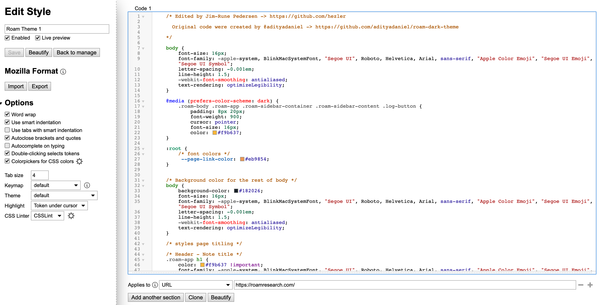

# roam-research-theme

Customize your Roam Research site. This is a custom theme for Roam Research that edits the layout and colouration of the site.

# Installation:
1. Please use the Stylus extension.
2. Go to https://roamresearch.com/
3. Click the extension tab and in Stylus you click "this URL" in "Write style for:".
4. Put this in & repit with the second part of the theme:
  
  
  
 
