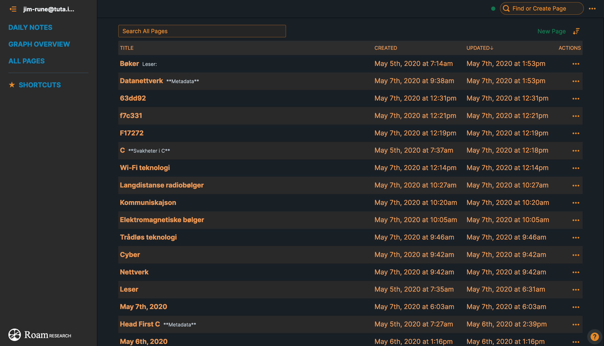

# roam-research-theme

Customize your Roam Research site. This is a custom theme for Roam Research that edits the layout and colouration of the site.

# Installation:
1. Please use the Stylus extension.
2. Go to https://roamresearch.com/
3. Click the extension tab and in Stylus you click "this URL" in "Write style for:".
4. Put this in & repit with the second part of the theme:
  
  
  
# How it looks 
  
  
  
  

# Missing some colors?
  <strong> - here is the answer </strong>
  
You have to manually put in the light green on "Kapittel 1" by your self.
 
  1. Simply put this code in: $$\text{\color{#63dd92}Kapittel 1 - Intro til }$$
        The light green comes from the HEX color code #63dd92
        
  2. Simply put this code in: $$\text{\color{#63dd92}Kapittel 1 - Intro til }$$
        The light green comes from the HEX color code #63dd92
 
 
